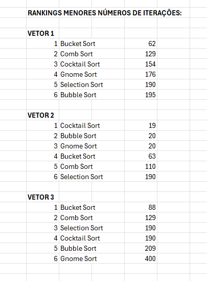
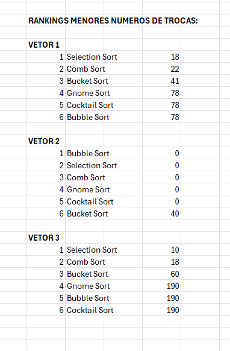
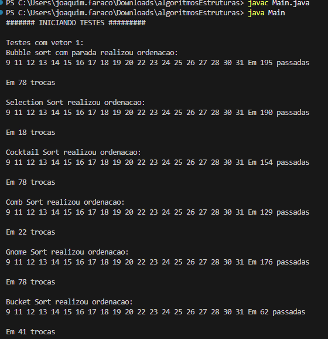
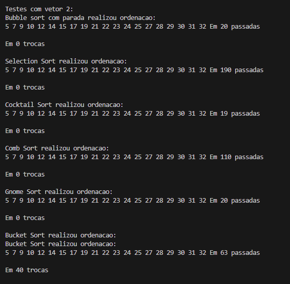
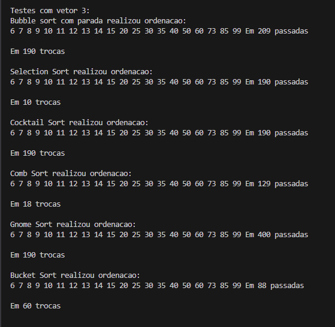

# ordenacaoTDE3  
- PUC-PR - Bacharelado em Ciência da Computação - Resolução de Problemas Estruturados em Computação Professor Andrey Cabral Meira  
- TDE 3 - Ordenação - Individual  
- ALUNO - JOAQUIM DOS ANJOS FARACO  
- Main.java roda os testes nos codigos de cada uma das classes.
- **Graficos de performance e prints das saídas no terminal:** (disponiveis na pasta resultadosTestes).
- 
- 
- 
- 
- 
